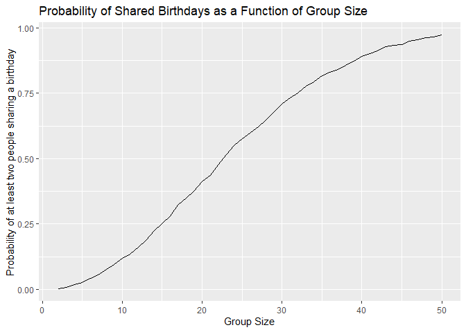
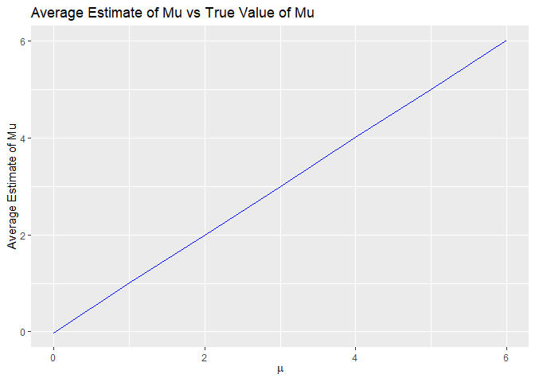
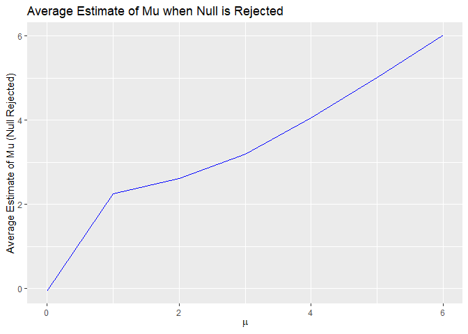

p8105_hw5_jw4690
================
Jingxi Wang
2024-11-06

## Problem 1

``` r
bday_sim = function(n) {
  bdays = sample(1:365, size = n, replace = TRUE)
  duplicate = length(unique(bdays)) < n
  return(duplicate)
}

sim_res = expand_grid(
  n = 2:50,
  iter = 1:10000
) |>
  mutate(res = map_lgl(n, bday_sim)) |>
  group_by(n) |>
  summarize(prob = mean(res))

sim_res_plot = sim_res |>
  ggplot(aes(x = n, y = prob)) +
  geom_line() +
  labs(
    title = "Probability of Shared Birthdays as a Function of Group Size",
    x = "Group Size",
    y = "Probability of at least two people sharing a birthday"
  )

sim_res_plot
```

<!-- -->

The probability of shared birthdays increases sharply as the group size
grows. As the group size reaches around 50, the probability approaches
nearly 100%, indicating that it’s almost certain that at least two
people in the group will share a birthday.

## Problem 2

``` r
sim_power = function(mu, n = 30, sigma = 5, alpha = 0.05) {
  sim_data = 
    tibble(
      x = rnorm(n, mean = mu, sd = sigma)
      )
  
  t_test = t.test(sim_data$x, mu = 0)
  result = broom::tidy(t_test)
  
  out_df = tibble(
    estimate = result$estimate,
    p_value = result$p.value
  )
  
  return(out_df)
}
```

``` r
n_sim = 5000
mu_values = c(0, 1, 2, 3, 4, 5, 6)

sim_res_2 = expand_grid(
  mu = mu_values,
  iter = 1:n_sim
) |>
  mutate(sim_output = map(mu, sim_power)) |>
  unnest(sim_output) |>
  group_by(mu) |>
  summarize(
    power = mean(p_value < 0.05),
    avg_estimate = mean(estimate),
    avg_estimate_rejected = mean(estimate[p_value < 0.05])
  )
```

``` r
# Make a plot showing the proportion of times the null was rejected (the power of the test) on the y axis and the true value of μ on the x axis.

sim_res_2_plot = sim_res_2 |>
  ggplot(aes(x = mu, y = power)) +
  geom_line() +
  labs(
    title = "Power of the Test as a Function of Effect Size (mu)",
    x = expression(mu),
    y = "Power (Probability of Rejecting Null)"
  )

sim_res_2_plot
```

<!-- -->

There is a strong, positive association between effect size and power.
Larger effect sizes increase the probability of detecting an effect. As
the effect size μ increases, the power of the test also increases. This
means that the test is more likely to correctly reject the null
hypothesis as the true difference from the hypothesized mean μ=0 becomes
larger.

``` r
# average estimate of μ_hat on the y axis and the true value of μ on the x axis.

sim_res_2_plot2 = sim_res_2 |>
  ggplot(aes(x = mu, y = avg_estimate)) +
  geom_line(color = "blue") +
  labs(
    title = "Average Estimate of Mu vs True Value of Mu",
    x = expression(mu),
    y = "Average Estimate of Mu"
  )

sim_res_2_plot2
```

<!-- -->

This plot shows the average estimated μ hat across all simulations,
regardless of whether the null hypothesis was rejected. It follows the
true value of μ linearly, indicating that, on average, the estimates are
unbiased for all values of μ.

``` r
# average estimate of μ_hat only in samples for which the null was rejected on the y axis and the true value of μ on the x axis.

sim_res_2_plot3 = sim_res_2 |>
  ggplot(aes(x = mu, y = avg_estimate_rejected)) +
  geom_line(color = "blue") +
  labs(
    title = "Average Estimate of Mu when Null is Rejected",
    x = expression(mu),
    y = "Average Estimate of Mu (Null Rejected)"
  )

sim_res_2_plot3
```

<!-- -->

This plot shows the average estimate of μ only for simulations where the
null hypothesis μ=0 was rejected. For smaller values of μ, the estimates
are slightly biased upward, as only larger sample means tend to lead to
rejection of the null.

The sample average of μ hat in tests where the null is rejected is not
always equal to the true value of μ. For smaller values of μ, this
average is biased upward because only higher sample means lead to
rejection of the null. As μ increases, this bias diminishes, and the
average estimate aligns more closely with the true μ, since larger
effect sizes increase the likelihood of observing a sample mean that
reflects the true population mean without the need for unusually high
values to achieve significance.

## Problem 3

``` r
homicide_df = read_csv("./data/homicide-data.csv")
```

    ## Rows: 52179 Columns: 12
    ## ── Column specification ────────────────────────────────────────────────────────
    ## Delimiter: ","
    ## chr (9): uid, victim_last, victim_first, victim_race, victim_age, victim_sex...
    ## dbl (3): reported_date, lat, lon
    ## 
    ## ℹ Use `spec()` to retrieve the full column specification for this data.
    ## ℹ Specify the column types or set `show_col_types = FALSE` to quiet this message.
